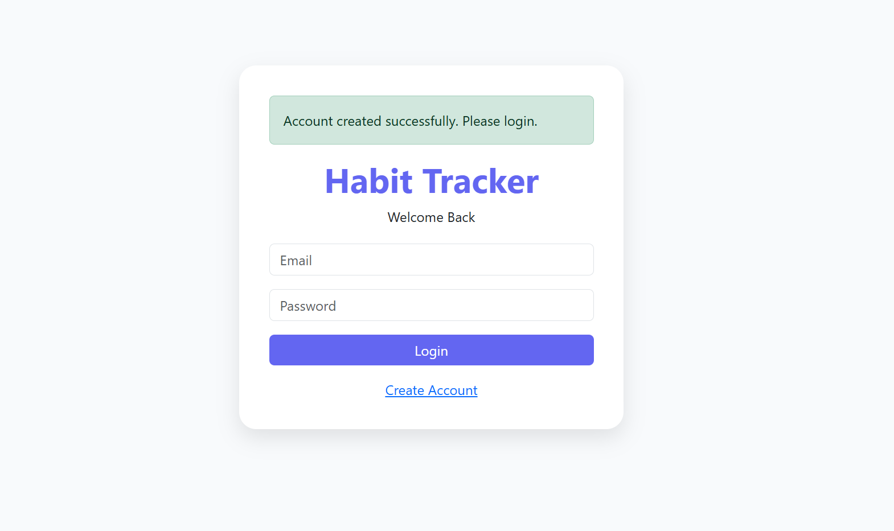
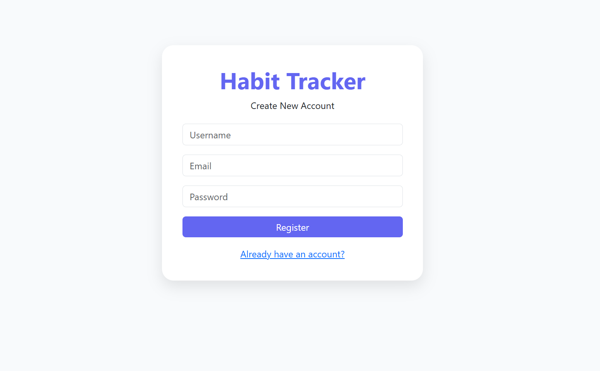
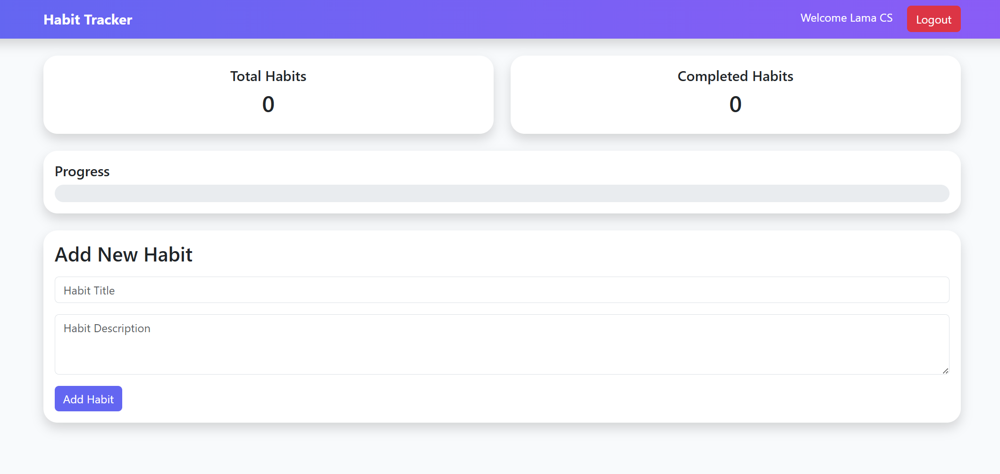

# Habit Tracker

A full-stack web application built with Flask and SQLite that helps users track their daily habits.

## Features

* User Registration
* User Login & Logout
* Password Hashing
* Session Authentication
* Add Habits
* Edit Habits
* Delete Habits
* Mark Habits as Completed
* Progress Tracking
* Dashboard Statistics

## Technologies Used

* Python
* Flask
* SQLite
* SQLAlchemy
* Bootstrap 5
* HTML/CSS

## Screenshots

### main interface

### Login

### Signup

### Dashboard

### Habits List

### Edit Habit

